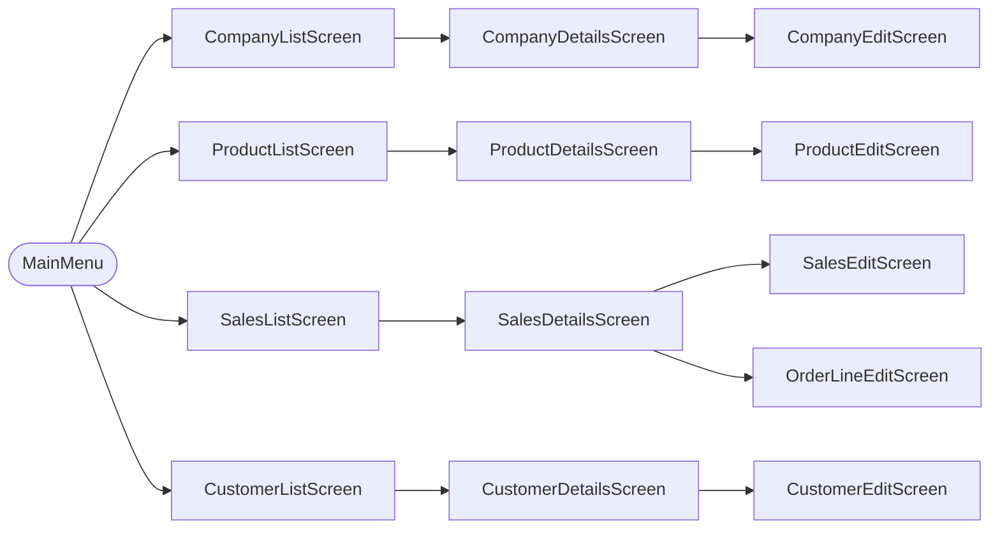

# ERP-CLI — LNE Security

A command-line ERP system built in C# / .NET 10 for **LNE Security A/S**, a fictional Danish IT-services company based in Aalborg. The architecture is modular, designed to support multiple developers.

## Features

- **Company Management** — Register and manage company information with address details
- **Product Catalog** — Create and maintain products with pricing
- **Sales Orders** — Create sales orders with multiple order lines, track completion status
- **Customer Management** — Manage customer records with contact information
- **Order Line Management** — Edit individual order lines within sales orders
- **Auto-Migrations** — Database schema automatically initializes on first run

## Prerequisites

- [.NET 10 SDK (preview)](https://dotnet.microsoft.com/download/dotnet/10.0)
- Microsoft SQL Server (mixed-mode authentication enabled)
- A local clone of the [TECHCOOL fork](https://github.com/TobiasAagaard/TECHCOOL) — the project references it as a sibling folder, not a NuGet package

## Setup

**1. Clone both repos side by side**

```bash
git clone https://github.com/TobiasAagaard/TECHCOOL.git
git clone https://github.com/TobiasAagaard/ERP-CLI ERP-CLI
```

```
Projects/
  TECHCOOL/
  ERP-CLI/
```

**2. Start SQL Server**

```bash
docker run -e "ACCEPT_EULA=Y" -e "MSSQL_SA_PASSWORD=<Your@Password123>" \
  -p 1433:1433 --name erp-sql -d mcr.microsoft.com/mssql/server:2022-latest
```

**3. Create `appsettings.Local.json`** in the root of `ERP-CLI/` (git-ignored):

```json
{
  "Database": {
    "DataSource": "localhost",
    "UserId": "sa",
    "Password": "<YourPassword>",
    "InitialCatalog": "ERP_CLI"
  }
}
```

**4. Build and run**

```bash
dotnet build
dotnet run
```
> **Note:** On startup, the app automatically creates the `ERP_CLI` database (if it doesn’t exist) and runs the migrations from [`Migrations/`](Migrations/) to set up the schema.

## Architecture

Three layers — **Views**, **Models**, **Data** — wired through a `Database.Instance` singleton. Navigation uses TECHCOOL's `Screen` and `Menu` primitives.

### Layer Overview

| Layer | Purpose | Examples |
|-------|---------|----------|
| **Views** | User interface screens and menus | `CompanyListScreen`, `SalesEditScreen` |
| **Models** | Data models representing domain entities | `Company`, `Product`, `SalesOrderHeader` |
| **Data** | Database access and queries | `CompanyDatabase`, `OrderLineDatabase` |

### Navigation Flow



### Screen Behavior

Each list screen loads records, registers function keys, and opens related screens:
- **F1/F3** — Create new record
- **F2** — Edit selected record
- **F5** — Delete selected record
- **Enter** — View details of selected record

### Data Model

Sales orders are a header (`SalesOrderHeader`) with many lines (`OrderLine`). Setting status to `Færdig` automatically stamps `OrderCompletedAt`.


## Tests

Unit tests use [xUnit](https://xunit.net/) and follow `MethodName_Scenario_ExpectedBehavior` naming with Arrange–Act–Assert structure.

```bash
dotnet test
```

## Development

### Adding a New Feature

1. **Create the Model** in `Models/` — define the data structure
2. **Create the Database Class** in `Data/` — implement CRUD operations
3. **Create the Views** in `Views/` — list, details, and edit screens
4. **Register in MainMenu** — add navigation entry to `MainMenu.cs`
5. **Add Tests** in `ERP-CLI.Tests/` — verify business logic
6. **Create Migration** in `Migrations/` — update database schema if needed

### Running Locally

```bash
# Build and run
dotnet build
dotnet run

# Run with watch mode (auto-rebuild on changes)
dotnet watch run

# Run tests
dotnet test

# Run specific test
dotnet test --filter "TestClassName"
```

## Contributors

- [Nicklas](https://github.com/NickRaics)
- [Tobias](https://github.com/TobiasAagaard)
- [Malthe](https://github.com/Malthebk3)
